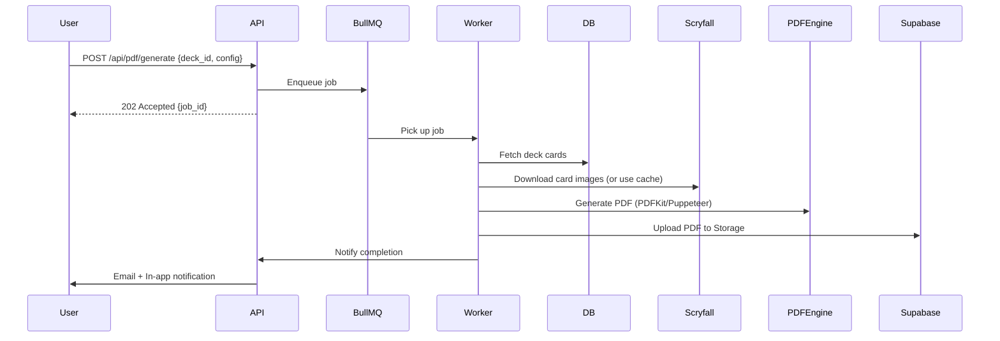

# PDF Generation

Generate print-ready proxy sheets with advanced configuration (inspired by proxxied.com).

---

## Overview

Decksmith's PDF generator is a **worker-based async system** that produces high-quality,
customizable proxy sheets. Users configure paper format, grid layout, margins, cut lines, and DPI
before generating.

**Key Features:**

- **Proxxied.com-inspired UI:** Live preview, advanced customization
- **Async generation:** BullMQ + Redis job queue (handles 30-60s+ jobs)
- **Multiple quality presets:** Draft (150 DPI) → Ultra (1200 DPI)
- **Print specifications:** 63×88mm cards, 300 DPI default, bleed + safe zones
- **Retry on failure:** Automatic retry if Scryfall image download fails

---

## Worker Job Workflow



**Steps:**

1. **User configures PDF** in modal (paper, grid, margins, DPI)
2. **API creates job** in BullMQ queue with config
3. **Worker picks up job** and:
   - Fetches deck cards from DB (filtered by section/selection)
   - Downloads high-res images from Scryfall (cached in browser/CDN)
   - Generates PDF using layout engine (PDFKit or Puppeteer)
   - Uploads PDF to Supabase Storage
   - Sends notification (email + in-app)
4. **User downloads PDF** via link in notification

**Error Handling:**

- Image download fails → Retry 3 times with backoff
- PDF generation crashes → Log error, mark job as failed
- Job takes > 5 minutes → Timeout, retry once
- All retries fail → Notify user "PDF generation failed, please try again"

---

## Configuration Options

### Paper Format

| Option        | Dimensions                     | Use Case                        |
| ------------- | ------------------------------ | ------------------------------- |
| **A4**        | 210 × 297 mm                   | European standard               |
| **US Letter** | 8.5 × 11 in (215.9 × 279.4 mm) | American standard               |
| **Custom**    | User-defined (width × height)  | Special printers, large formats |

**Default:** A4

---

### Grid Layout

| Preset     | Grid               | Cards/Page   | Use Case             |
| ---------- | ------------------ | ------------ | -------------------- |
| **3×3**    | 3 columns × 3 rows | 9 cards      | Standard, balanced   |
| **2×4**    | 2 columns × 4 rows | 8 cards      | Portrait orientation |
| **3×4**    | 3 columns × 4 rows | 12 cards     | High density         |
| **Custom** | N × M (up to 5×5)  | User-defined | Advanced users       |

**Default:** 3×3

---

### Margins

**Independent sliders** for each side:

- Top: 0-30mm (default 10mm)
- Bottom: 0-30mm (default 10mm)
- Left: 0-30mm (default 10mm)
- Right: 0-30mm (default 10mm)

**Purpose:** Account for printer margins, ensure cards don't get cut off.

---

### Spacing

**Horizontal/Vertical gap** between cards:

- Range: 0-10mm (default 3mm)
- Purpose: Safe cutting space, avoid overlapping cards

---

### Cut Lines

**Options:**

- **Show/Hide:** Toggle cut lines ON/OFF
- **Color:** Picker (default black #000000)
- **Thickness:** 0.1-1mm (default 0.3mm)
- **Style:** Solid, dashed, dotted

**Types:**

- **Corner marks:** L-shaped marks at card corners (minimal ink)
- **Full lines:** Complete grid lines (easier cutting)

**Default:** Corner marks, black, 0.3mm

---

### Bleed Marks

**Options:**

- **Corner marks:** Small crosses at bleed corners
- **Center marks:** Crosses on card edges (top/bottom/left/right)
- **Both:** All marks
- **None:** No bleed marks

**Purpose:** Professional printing alignment.

---

### DPI/Quality

| Preset       | DPI  | File Size (60 cards) | Use Case                              |
| ------------ | ---- | -------------------- | ------------------------------------- |
| **Draft**    | 150  | ~10 MB               | Quick preview, playtesting            |
| **Standard** | 300  | ~40 MB               | Home printing, casual proxies         |
| **High**     | 600  | ~150 MB              | Print shop quality                    |
| **Ultra**    | 1200 | ~600 MB              | Professional printing (Pro tier only) |

**Default:** Standard (300 DPI)

**Image Resolution Calculation:**

```
Card dimensions: 63 × 88 mm
At 300 DPI: 744 × 1039 pixels (with 3mm bleed)
At 600 DPI: 1488 × 2078 pixels
At 1200 DPI: 2976 × 4156 pixels
```

---

### Card Selection

**Options:**

1. **All cards:** Include every card in deck
2. **By section:** Only cards from selected sections (e.g., "Mainboard only")
3. **Only missing:** Coverage-based filter (cards NOT in collection)
4. **Manual multi-select:** Checkboxes to select specific cards

**Default:** All cards

---

### Card Backs

**Options:**

- **None:** Front-side only (single-sided printing)
- **Separate pages:** Card backs on pages after fronts (double-sided printing)
- **Interleaved:** Front, back, front, back (for manual feed printers)

**Card Back Source:**

- Official Magic card back image (public domain)
- Custom backs (future feature: upload custom image)

---

### Crop to Bleed

**Options:**

- **Include bleed:** 3mm extra around each card (default)
- **Crop to exact size:** 63×88mm precise (for perfect pre-cut paper)

**Default:** Include bleed

---

### Safe Zone Guides

**Options:**

- **Show safe zone:** Overlay 5mm inner border (red dotted line) on preview
- **Hide:** No overlay

**Purpose:** Preview where critical text/icons should stay to avoid sleeve obscuring.

**Default:** Shown in preview, hidden in final PDF

---

## Print Specifications

### Card Dimensions

- **Standard:** 63 × 88 mm (2.5 × 3.5 inches)
- **With bleed:** 69 × 94 mm (3mm bleed on all sides)

### Image Resolution

- **300 DPI:** 744 × 1039 pixels (standard quality)
- **600 DPI:** 1488 × 2078 pixels (high quality)
- **1200 DPI:** 2976 × 4156 pixels (ultra quality)

### Bleed Area

- **Default:** 3mm around each card
- **Configurable:** 0-5mm range
- **Purpose:** Safe trimming margin, prevents white edges

### Safe Zone

- **Inner margin:** 5mm from card edge
- **Purpose:** Keep text/icons away from sleeve edges
- **Recommendation:** Place mana costs, card names inside safe zone

### Cardstock Recommendation

- **330gsm Black Core:** Industry standard for proxies
- **310gsm German Black Core:** Premium option
- **Passes light test:** Opaque when sleeved

---

## API Endpoints

### `POST /api/pdf/generate`

**Description:** Create PDF generation job.

**Request Body:**

```json
{
  "deck_id": "uuid",
  "config": {
    "paper_format": "a4", // "a4", "letter", "custom"
    "custom_dimensions": null, // {width: 210, height: 297} if custom
    "grid": { "columns": 3, "rows": 3 },
    "margins": { "top": 10, "bottom": 10, "left": 10, "right": 10 },
    "spacing": { "horizontal": 3, "vertical": 3 },
    "cut_lines": {
      "enabled": true,
      "color": "#000000",
      "thickness": 0.3,
      "style": "solid"
    },
    "bleed_marks": "corner", // "corner", "center", "both", "none"
    "dpi": 300,
    "card_selection": "all", // "all", "section:{id}", "missing", "manual"
    "selected_card_ids": [], // if manual
    "card_backs": "separate", // "none", "separate", "interleaved"
    "crop_to_bleed": false
  }
}
```

**Response:** `202 Accepted`

```json
{
  "job_id": "uuid",
  "status": "queued",
  "estimated_time": 45, // seconds
  "message": "PDF generation started. You'll be notified when ready."
}
```

---

### `GET /api/pdf/jobs/:job_id`

**Description:** Check job status.

**Response:**

```json
{
  "job_id": "uuid",
  "status": "completed", // "queued", "processing", "completed", "failed"
  "progress": 100, // 0-100%
  "created_at": "2024-01-15T10:00:00Z",
  "completed_at": "2024-01-15T10:00:45Z",
  "download_url": "https://storage.supabase.co/decksmith/pdfs/uuid.pdf",
  "expires_at": "2024-01-22T10:00:45Z" // 7 days from completion
}
```

---

### `DELETE /api/pdf/jobs/:job_id`

**Description:** Cancel pending job or delete completed PDF.

**Response:** `204 No Content`

---

## PDF Generation Logic

### Layout Engine Options

**Option 1: PDFKit (Recommended)**

- Node.js library for PDF generation
- Vector-based (sharp lines, small file size)
- Programmatic layout (easy grid calculations)

**Option 2: Puppeteer**

- Headless Chrome, renders HTML → PDF
- Pixel-perfect (matches browser rendering)
- Heavier (requires Chrome binary), slower

**Recommendation:** PDFKit for MVP (faster, lighter)

---

### Grid Calculation

```typescript
// packages/pdf/src/layout/grid.ts
export function calculateGridLayout(config: PDFConfig) {
  const { paper, grid, margins, spacing } = config;

  // Available space (minus margins)
  const availableWidth = paper.width - margins.left - margins.right;
  const availableHeight = paper.height - margins.top - margins.bottom;

  // Card dimensions (with bleed if enabled)
  const cardWidth = config.crop_to_bleed ? 63 : 69; // mm
  const cardHeight = config.crop_to_bleed ? 88 : 94; // mm

  // Total spacing
  const totalHSpacing = (grid.columns - 1) * spacing.horizontal;
  const totalVSpacing = (grid.rows - 1) * spacing.vertical;

  // Check if cards fit
  const requiredWidth = grid.columns * cardWidth + totalHSpacing;
  const requiredHeight = grid.rows * cardHeight + totalVSpacing;

  if (requiredWidth > availableWidth || requiredHeight > availableHeight) {
    throw new Error('Grid does not fit on page. Reduce grid size or increase margins.');
  }

  // Calculate positions
  const positions = [];
  for (let row = 0; row < grid.rows; row++) {
    for (let col = 0; col < grid.columns; col++) {
      positions.push({
        x: margins.left + col * (cardWidth + spacing.horizontal),
        y: margins.top + row * (cardHeight + spacing.vertical),
        width: cardWidth,
        height: cardHeight,
      });
    }
  }

  return positions;
}
```

---

### Image Download & Caching

```typescript
// apps/worker/src/pdf/image-loader.ts
export async function downloadCardImages(cards: DeckCard[]): Promise<Map<string, Buffer>> {
  const images = new Map<string, Buffer>();

  for (const card of cards) {
    const imageUrl = selectImageUrl(card.cardPrint, config.dpi);

    // Check cache first
    const cached = await redis.get(`image:${card.cardPrint.scryfall_id}:${config.dpi}`);
    if (cached) {
      images.set(card.id, Buffer.from(cached, 'base64'));
      continue;
    }

    // Download from Scryfall
    try {
      const response = await fetch(imageUrl, { timeout: 10000 });
      const buffer = await response.buffer();

      // Cache for 7 days
      await redis.setex(
        `image:${card.cardPrint.scryfall_id}:${config.dpi}`,
        604800,
        buffer.toString('base64')
      );

      images.set(card.id, buffer);
    } catch (error) {
      throw new Error(`Failed to download image for ${card.cardPrint.card.name}: ${error.message}`);
    }
  }

  return images;
}

function selectImageUrl(cardPrint: CardPrint, dpi: number): string {
  // Scryfall image URIs by quality
  if (dpi >= 1200 && cardPrint.image_uris.png) {
    return cardPrint.image_uris.png; // Highest quality
  }
  if (dpi >= 600 && cardPrint.image_uris.large) {
    return cardPrint.image_uris.large; // 672×936px
  }
  return cardPrint.image_uris.normal; // 488×680px (default)
}
```

---

### PDF Assembly (PDFKit)

```typescript
// apps/worker/src/pdf/generator.ts
import PDFDocument from 'pdfkit';

export async function generatePDF(
  cards: DeckCard[],
  images: Map<string, Buffer>,
  config: PDFConfig
): Promise<Buffer> {
  const doc = new PDFDocument({
    size: [config.paper.width, config.paper.height],
    margin: 0,
  });

  const chunks: Buffer[] = [];
  doc.on('data', (chunk) => chunks.push(chunk));

  const positions = calculateGridLayout(config);
  let cardIndex = 0;
  let pageIndex = 0;

  while (cardIndex < cards.length) {
    if (pageIndex > 0) doc.addPage();

    // Draw grid of cards
    for (const pos of positions) {
      if (cardIndex >= cards.length) break;

      const card = cards[cardIndex];
      const image = images.get(card.id);

      // Draw card image
      doc.image(image, pos.x, pos.y, {
        width: pos.width,
        height: pos.height,
      });

      // Draw cut lines (if enabled)
      if (config.cut_lines.enabled) {
        drawCutLines(doc, pos, config.cut_lines);
      }

      cardIndex++;
    }

    pageIndex++;
  }

  doc.end();

  return new Promise((resolve) => {
    doc.on('end', () => resolve(Buffer.concat(chunks)));
  });
}

function drawCutLines(doc: PDFDocument, pos: Position, config: CutLineConfig) {
  doc.strokeColor(config.color);
  doc.lineWidth(config.thickness);

  // Corner marks (8mm long)
  const markLength = 8;

  // Top-left
  doc
    .moveTo(pos.x, pos.y - markLength)
    .lineTo(pos.x, pos.y)
    .stroke();
  doc
    .moveTo(pos.x - markLength, pos.y)
    .lineTo(pos.x, pos.y)
    .stroke();

  // Top-right
  doc
    .moveTo(pos.x + pos.width, pos.y - markLength)
    .lineTo(pos.x + pos.width, pos.y)
    .stroke();
  doc
    .moveTo(pos.x + pos.width, pos.y)
    .lineTo(pos.x + pos.width + markLength, pos.y)
    .stroke();

  // ... (bottom corners similar)
}
```

---

## BullMQ Job Queue

**Queue Configuration:**

```typescript
// apps/worker/src/queue.ts
export const pdfQueue = new Queue('pdf-generation', {
  connection: redisConnection,
  defaultJobOptions: {
    attempts: 3, // Retry up to 3 times
    backoff: {
      type: 'exponential',
      delay: 5000, // 5s, 25s, 125s
    },
    removeOnComplete: 100, // Keep last 100 completed jobs
    removeOnFail: 500, // Keep last 500 failures
  },
});

// Worker
const pdfWorker = new Worker(
  'pdf-generation',
  async (job) => {
    const { deck_id, config, user_id } = job.data;

    // Update progress
    job.updateProgress(10);

    // Fetch deck cards
    const cards = await fetchDeckCards(deck_id, config.card_selection);
    job.updateProgress(20);

    // Download images
    const images = await downloadCardImages(cards);
    job.updateProgress(60);

    // Generate PDF
    const pdfBuffer = await generatePDF(cards, images, config);
    job.updateProgress(90);

    // Upload to Supabase Storage
    const { data, error } = await supabase.storage
      .from('pdfs')
      .upload(`${user_id}/${job.id}.pdf`, pdfBuffer, {
        contentType: 'application/pdf',
      });

    if (error) throw error;
    job.updateProgress(100);

    // Notify user
    await sendNotification(user_id, {
      type: 'pdf_ready',
      job_id: job.id,
      download_url: data.publicUrl,
    });

    return { download_url: data.publicUrl };
  },
  {
    connection: redisConnection,
    concurrency: 5, // Max 5 PDFs generating at once
  }
);
```

---

## Business Rules

1. **Max 500 cards per PDF** (prevent abuse/long generation times)
2. **PDF stored for 7 days**, then auto-deleted (storage optimization)
3. **Free tier:** 10 PDFs/month
4. **Pro tier:** Unlimited PDFs + Ultra DPI (1200)
5. **Rate limiting:** Max 3 concurrent jobs per user

---

## UI Patterns

### PDF Config Modal

```
┌──────────────────────────────────────────────┐
│ Generate Proxy PDF                      [X]  │
├──────────────────────────────────────────────┤
│ ┌─ Paper ───────────┐  ┌─ Preview ────────┐ │
│ │ ◉ A4              │  │                  │ │
│ │ ○ US Letter       │  │  [Live preview]  │ │
│ │ ○ Custom          │  │  [of first page] │ │
│ └───────────────────┘  │                  │ │
│ ┌─ Grid ────────────┐  └──────────────────┘ │
│ │ Columns: [3 ▾]    │                       │
│ │ Rows:    [3 ▾]    │                       │
│ └───────────────────┘                       │
│ ┌─ Margins (mm) ────┐                       │
│ │ Top:    [10] ──   │                       │
│ │ Bottom: [10] ──   │                       │
│ │ Left:   [10] ──   │                       │
│ │ Right:  [10] ──   │                       │
│ └───────────────────┘                       │
│ ┌─ Quality ─────────┐                       │
│ │ ◉ Standard (300)  │                       │
│ │ ○ High (600)      │                       │
│ │ ○ Ultra (1200)🔒  │  ← Pro only          │
│ └───────────────────┘                       │
│                                              │
│ [Cancel]                   [Generate PDF]   │
└──────────────────────────────────────────────┘
```

---

### Progress Indicator

```
┌──────────────────────────────────┐
│ Generating PDF...                │
│ ██████████████░░░░░░ 70%        │
│ Downloading images (42/60)...    │
└──────────────────────────────────┘
```

---

### Notification (Email)

```
Subject: Your proxy PDF is ready!

Hi there,

Your proxy PDF for "Atraxa Superfriends" is ready to download.

[Download PDF] (expires in 7 days)

Details:
- 60 cards
- 7 pages (3×3 grid, A4)
- 300 DPI
- Generated at 2024-01-15 10:00 UTC

Happy playtesting!
– Decksmith
```

---

## Mobile Considerations

### Mobile Web (320-767px)

**Print Job Creator (Text-Based):**

- **No visual builder**: Visual drag-and-drop layout doesn't work well on 320px screens
- **Simplified interface** (see [ADR-0009](../adr/0009-responsive-feature-strategy.md)):
  1. **Select deck**: Dropdown to choose deck
  2. **Select cards**: Checkboxes for which cards to include (all by default)
  3. **Configure settings**: Paper size (A4/Letter), cards per page (9/12), quality
     (draft/standard/high/ultra)
  4. **Text preview**: "4x Lightning Bolt, 4x Goblin Guide, 3x Mountain..." (not visual sheet)
  5. **Generate button**: Large (44px height) → Triggers worker job

**Configuration Presets:**

- **Draft** (150 DPI, 3×3 grid, A4): Fast, low quality
- **Standard** (300 DPI, 3×3 grid, A4): Balanced (default)
- **High** (600 DPI, 3×3 grid, A4): Print-ready
- **Ultra** (1200 DPI, custom grid, A4): Maximum quality
- **Custom**: Advanced users can tap "Advanced Settings" → bottom sheet with full controls

**Job Status:**

- **Progress indicator**: "Generating PDF... (15-35 seconds)" with spinner
- **Notification**: When job completes → "Your PDF is ready! Tap to download."
- **Download button**: Opens PDF in browser (user saves or shares)

**PDF Management:**

- **View only**: List of generated PDFs (card list view)
- **Download**: Tap PDF → Opens in browser → Save to Files/Downloads
- **Delete**: Swipe left → Delete button
- **No editing**: Can't edit PDF settings on mobile (must create new job)

**Touch Interactions:**

- All buttons: 44px minimum
- Settings dropdowns: Large touch targets (56px row height)
- Card checkboxes: 44px × 44px
- Swipe-to-delete for PDF list

**Performance Targets:**

- Job submission: < 200ms (adds job to queue)
- Job completion notification: < 2s after worker finishes
- PDF download: Depends on file size (5-20 MB), show progress

**Offline Behavior:**

- Requires internet (job queue needs API connection)
- Error if offline: "No internet. PDF generation requires connection."

### Tablet (768-1023px)

**Hybrid interface:**

- **Simplified visual builder**: Grid preview (not full drag-and-drop)
- **Side-by-side**: Settings panel + preview (not full-screen)
- **Touch-optimized controls**: Larger buttons than desktop

### Desktop (1024px+)

**Full visual builder** (existing spec):

- Drag cards to grid positions
- Resize cards, adjust spacing
- Real-time canvas preview
- Advanced margin/spacing sliders

### Future Native Mobile

**Platform Features:**

- **Visual builder with touch**: Pinch-zoom, drag cards with finger
- **Share via system sheet**: Share PDF via WhatsApp, email, AirDrop
- **Save to device**: Direct save to Files app (iOS) or Downloads (Android)
- **Offline job queue**: Create print jobs offline, sync when online

**Performance:**

- Faster PDF generation: Native PDF rendering libraries (CoreGraphics on iOS, PdfDocument on
  Android)
- Background processing: Generate PDFs in background (doesn't block UI)

**Domain Logic Reuse:**

- PDF layout calculations (`calculateCardPositions`, `validateMargins`) in `packages/domain` work on
  web and native
- Worker uses `packages/pdf` (Node.js), native uses platform-specific rendering

### Related ADRs

- [ADR-0008: Mobile-First Web Design Principles](../adr/0008-mobile-first-web-design-principles.md)
  — Online-only strategy
- [ADR-0009: Responsive Feature Strategy](../adr/0009-responsive-feature-strategy.md) — Text-based
  creator on mobile
- [ADR-0007: Job Queue with BullMQ and Redis](../adr/0007-job-queue-bullmq-redis.md) — Async PDF
  generation

---

## Related Specs

- [Data Model](./data-model.md) — Deck, DeckCard schemas
- [Deck Management](./deck-management.md) — Card selection
- [User Preferences](./user-preferences.md) — Units (mm/inches)
